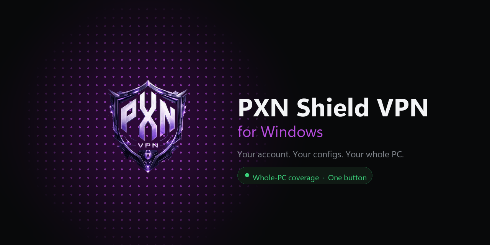

  

### [⬇ Download for Windows][latest]

Windows 10 / 11 · 64-bit · free with any [PXN Stores][site] plan

---

## What this is

The Windows client for **[PXN Stores LK][site]**.

Sign in with the account you bought your plan on and every config you own is
already here — no links to paste, no files to import, no QR codes to scan. Press
one button and your whole computer goes through the tunnel.

It is the same account, the same configs and the same Store as the phone app.

## Download

| | | |
|---|---|---|
| **Installer** | [`PXN-Shield-VPN-Setup-1.9.0.exe`][setup] | Adds a desktop and Start-menu shortcut. **Pick this one.** |
| **Portable** | [`PXN-Shield-VPN-Portable-1.9.0.zip`][portable] | Unzip anywhere and run `PxnShield.exe`. Nothing is written outside the folder. |

Everything the app needs is already inside — there is no runtime to install
first. Windows will ask for administrator permission, because creating a network
adapter needs it.

## What it does

|  |  |
|---|---|
| 🛡️ **Covers the whole PC** | A real network adapter, so games, launchers, and anything with its own network stack go through the tunnel too — not only apps that happen to honour a proxy setting. |
| 📊 **Your plans, live** | Data used and days left for every config on your account, straight from the panel. |
| 🛒 **Buy and renew in the app** | Same packages, same prices, same banks and the same transfer remark as the website. Add store credit without leaving the app. |
| 🌐 **Routing rules** | Cloudflare Warp+ or a Sri Lankan exit, switched from the app. The tunnel reconnects itself so the change takes effect straight away. |
| 📱 **Per-app tunnelling** | Send everything through, or pick exactly which programs use it. |
| 📡 **Ping and uptime** | A real round trip to the server, measured outside the tunnel so the number means something. |
| 📖 **Guides** | English, සිංහල and தமிழ். |
| 🌗 **Dark and light** | Dark by default. |

## Getting started

1. **Download and install** using the button above.
2. **Open it** and sign in with your PXN account. Every config you own arrives on
   its own. No account yet? Paste a `vless://` link instead — it works without
   one.
3. **Press the button.** That is the whole thing.

## If something goes wrong

**It says "Couldn't connect".** Try another config from the Configs screen. If
none of them connect, your package may be out of data or expired — the Usage
screen says which.

**The app opens to a blank window.** Windows is missing the Edge WebView2
runtime. The installer normally adds it; if it did not, install it once from
[Microsoft][webview2] and reopen the app.

**Sync or Refresh does nothing.** Sign out and back in from Settings. If it
still will not, send us the log.

**Anything else.** Open **Settings → Connection log → Open**, copy what it says,
and send it to us on WhatsApp. That log is the fastest route to an answer.

### [💬 WhatsApp support][whatsapp] · [🌐 pxnstores.lk][site]

## Also available

| | |
|---|---|
| **Android** | [pxn-shield-android][android] |
| **Windows** | you are here |

---

Built by **[PXN Stores LK][site]** in Sri Lanka · [Every release][releases]

This repository is the download channel. The source is private.

[latest]: https://github.com/NightRiderr77/pxn-shield-windows/releases/latest
[releases]: https://github.com/NightRiderr77/pxn-shield-windows/releases
[setup]: https://github.com/NightRiderr77/pxn-shield-windows/releases/latest/download/PXN-Shield-VPN-Setup-1.9.0.exe
[portable]: https://github.com/NightRiderr77/pxn-shield-windows/releases/latest/download/PXN-Shield-VPN-Portable-1.9.0.zip
[site]: https://www.pxnstores.lk
[whatsapp]: https://wa.me/94761546544
[android]: https://github.com/NightRiderr77/pxn-shield-android
[webview2]: https://go.microsoft.com/fwlink/p/?LinkId=2124703
